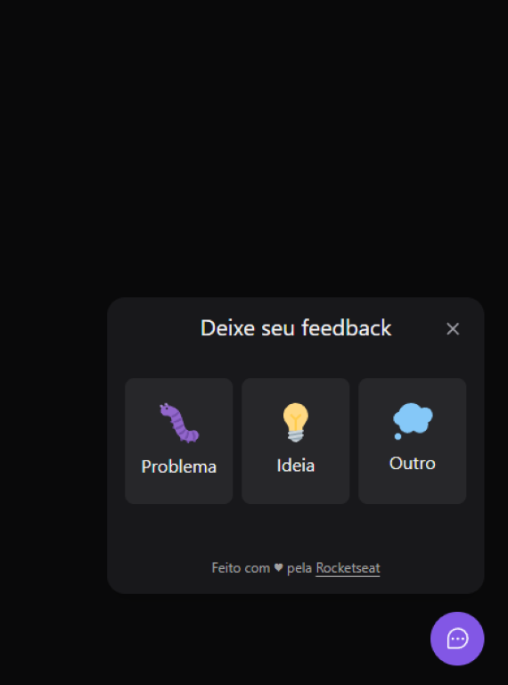
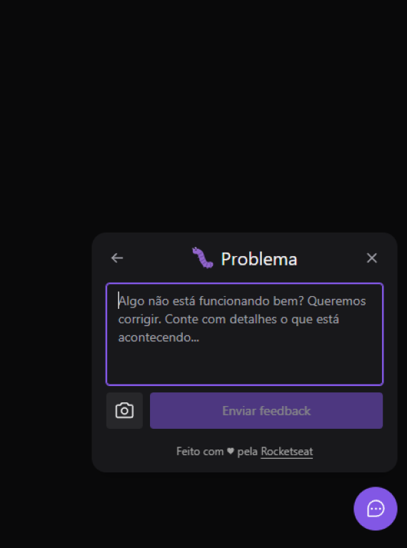
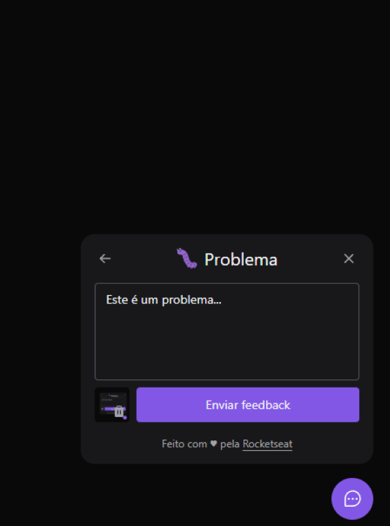
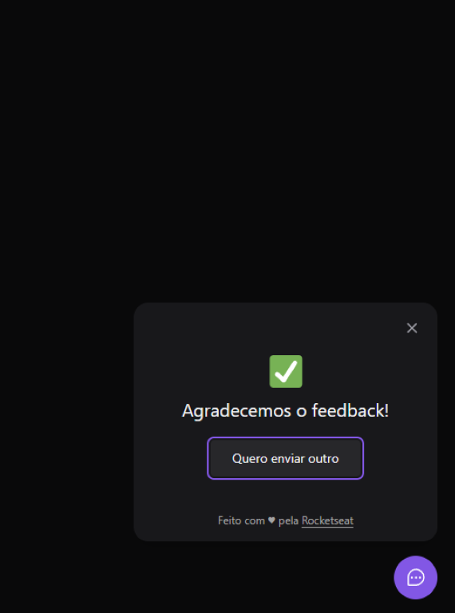
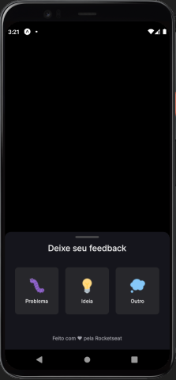
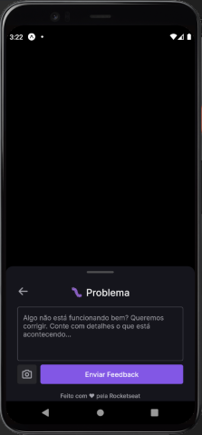
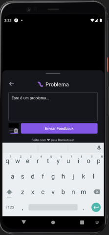
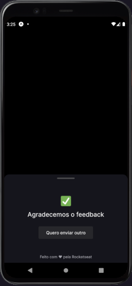

# FeedGet

The application is a widget that enables users to send feedback and take screenshots of their screen for submission.

## Screenshots

### Desktop App:

  
  
  
  

### Mobile App:

  
  
  
  

